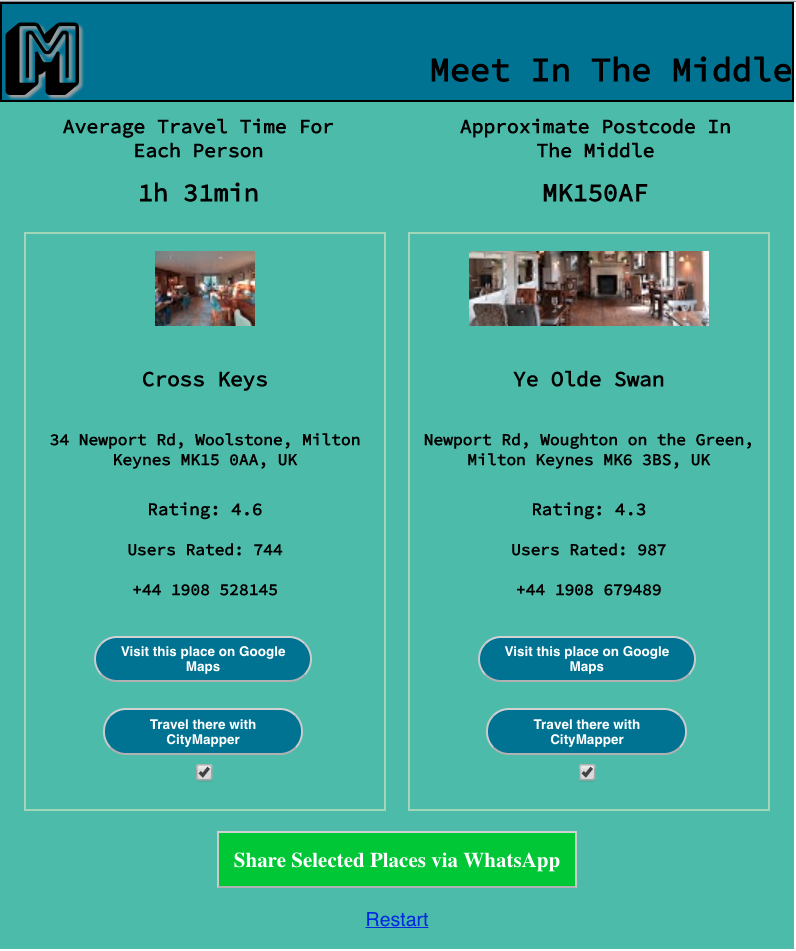

# Meet In The Middle
Web app allowing users to find shortlisted places in locations with approximate similar travel times for all entered postcodes.

## Features
- Allows entry of multiple postcodes (UK supported only)
- User has the option to travel to mid point via car or public transport
- User can chose to meet in a pub or restaurant
- Once the search is conducted, user can view the shortlisted 1 (min) or 2 (max) curated places. 
- WhatsApp share: User can share the link allowing other friends to view the selected place via WhatsApp
- Google Maps view: User can view the pub/restaurant details in Google Maps (link is initiated from the app itself with one click)
- CityMapper travel: User can trigger CityMapper app for the selected place with one click

## Deployment
Web app (also mobile friendly) deployed in Netlify here: https://friendly-allen-734a93.netlify.app/

## Built With
- React
- Ruby on Rails
- Postgres (via Active Records)
- APIs: Google Maps APIs (Places, nearbySearch), api.postcodes.io

## Installation
 In the project directory, run:

```bash
npm install
npm start
```
You will need to spin up the backend to this project which can also be found in my GitHub account. Please note that backend is not compulsory for the app to work.

## STEP-1: Postcodes Entry & Planning Options Chosen


## STEP-2: Planning Steps & Next Steps Communicated To User


## STEP-3: Curated Places Listed with WhatsApp share, Google Maps view & CityMapper travel initiation buttons


## Future Improvements
- Additional countries could be introduced.
- Custom CSS and responsive design are utilized within React technical capabilities. It could be refactored to make use of React Native

## Author
Basri Dogan