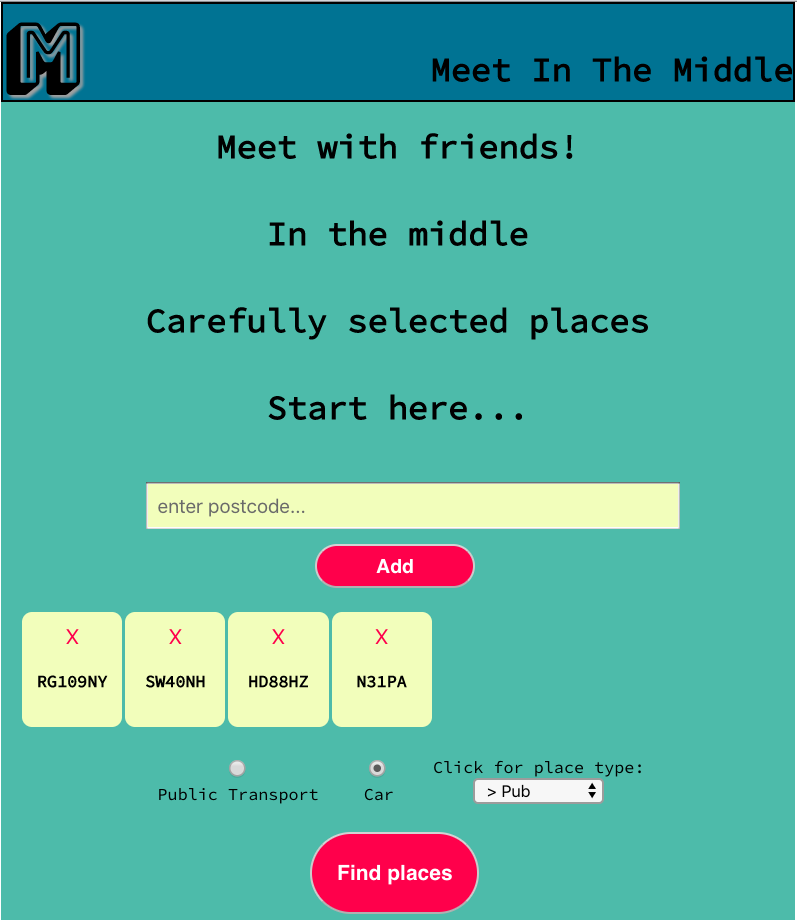
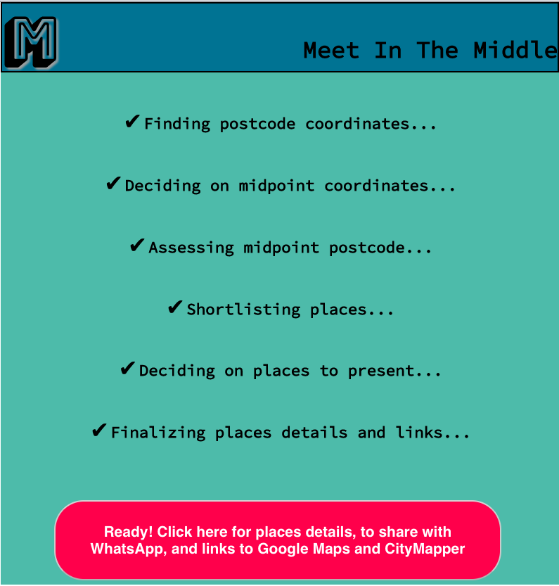

# Meet In The Middle
Web app allowing users to find shortlisted places in locations with approximate similar travel times for all entered postcodes.

## Features
- Allows entry of multiple postcodes (UK supported only)
- User has the option to travel to mid point via car or public transport
- User can chose to meet in a pub or restaurant
- Once the search is conducted, user can view the shortlisted 1 (min) or 2 (max) curated places. 
- WhatsApp share: User can share the link allowing other friends to view the selected place via WhatsApp
- Google Maps view: User can view the pub/restaurant details in Google Maps (link is initiated from the app itself with one click)
- CityMapper travel: User can trigger CityMapper app for the selected place with one click

## Deployment
Web app (also mobile friendly) deployed in Netlify here: https://friendly-allen-734a93.netlify.app/

## Built With
- React
- Ruby on Rails
- Postgres (via Active Records)
- APIs: Google Maps APIs (Places, nearbySearch), api.postcodes.io

## Installation
 In the project directory, run:

```bash
npm install
npm start
```
You will need to spin up the backend to this project which can also be found in my GitHub account. Please note that backend is not compulsory for the app to work.

## STEP-1: Postcodes Entry & Planning Options Chosen


## STEP-2: Planning Steps & Next Steps Communicated To User


## STEP-3: Curated Places Listed with WhatsApp share, Google Maps view & CityMapper travel initiation buttons


## Future Improvements
- Additional countries could be introduced.
- Custom CSS and responsive design are utilized within React technical capabilities. It could be refactored to make use of React Native

## Author
Basri Dogan


This project was bootstrapped with [Create React App](https://github.com/facebook/create-react-app).

## Available Scripts

In the project directory, you can run:

### `yarn start`

Runs the app in the development mode.<br />
Open [http://localhost:3000](http://localhost:3000) to view it in the browser.

The page will reload if you make edits.<br />
You will also see any lint errors in the console.

### `yarn test`

Launches the test runner in the interactive watch mode.<br />
See the section about [running tests](https://facebook.github.io/create-react-app/docs/running-tests) for more information.

### `yarn build`

Builds the app for production to the `build` folder.<br />
It correctly bundles React in production mode and optimizes the build for the best performance.

The build is minified and the filenames include the hashes.<br />
Your app is ready to be deployed!

See the section about [deployment](https://facebook.github.io/create-react-app/docs/deployment) for more information.

### `yarn eject`

**Note: this is a one-way operation. Once you `eject`, you can’t go back!**

If you aren’t satisfied with the build tool and configuration choices, you can `eject` at any time. This command will remove the single build dependency from your project.

Instead, it will copy all the configuration files and the transitive dependencies (Webpack, Babel, ESLint, etc) right into your project so you have full control over them. All of the commands except `eject` will still work, but they will point to the copied scripts so you can tweak them. At this point you’re on your own.

You don’t have to ever use `eject`. The curated feature set is suitable for small and middle deployments, and you shouldn’t feel obligated to use this feature. However we understand that this tool wouldn’t be useful if you couldn’t customize it when you are ready for it.

## Learn More

You can learn more in the [Create React App documentation](https://facebook.github.io/create-react-app/docs/getting-started).

To learn React, check out the [React documentation](https://reactjs.org/).

### Code Splitting

This section has moved here: https://facebook.github.io/create-react-app/docs/code-splitting

### Analyzing the Bundle Size

This section has moved here: https://facebook.github.io/create-react-app/docs/analyzing-the-bundle-size

### Making a Progressive Web App

This section has moved here: https://facebook.github.io/create-react-app/docs/making-a-progressive-web-app

### Advanced Configuration

This section has moved here: https://facebook.github.io/create-react-app/docs/advanced-configuration

### Deployment

This section has moved here: https://facebook.github.io/create-react-app/docs/deployment

### `yarn build` fails to minify

This section has moved here: https://facebook.github.io/create-react-app/docs/troubleshooting#npm-run-build-fails-to-minify
